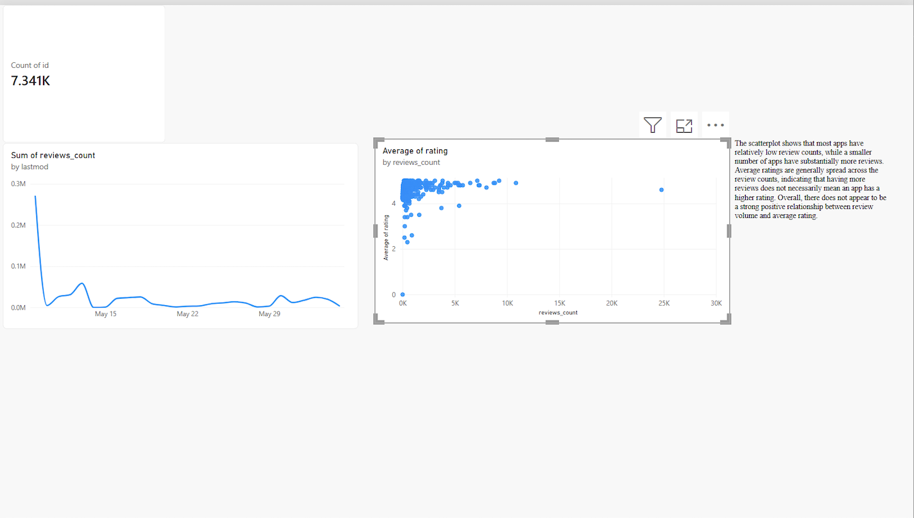
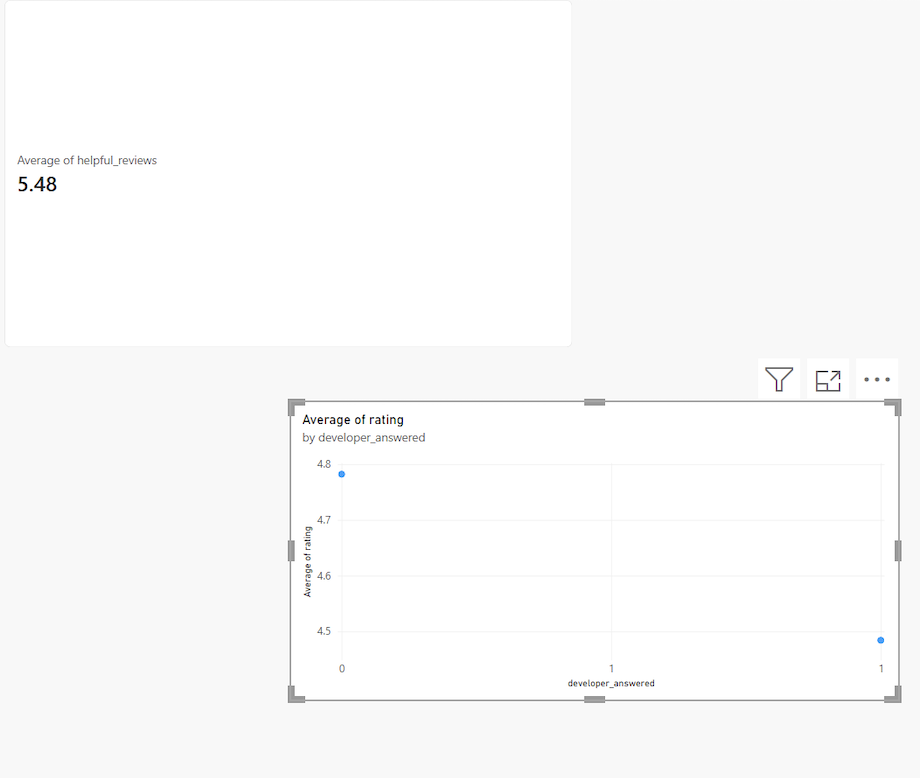
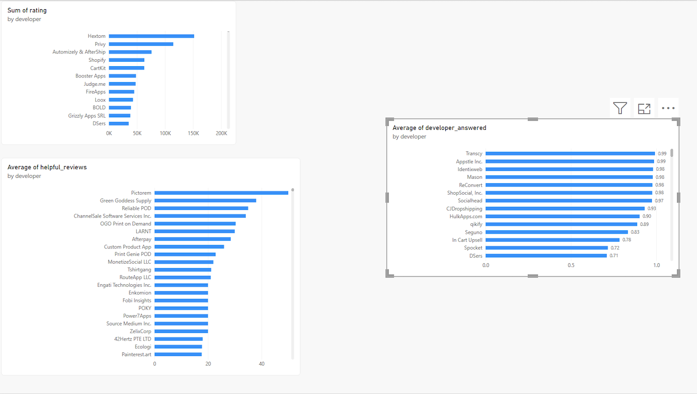

# Power BI App Analysis

## Project Overview

This project uses Microsoft Power BI to analyze app performance, user reviews, ratings, and developer engagement.

The goal is to identify patterns in app activity and user feedback that can support data-driven business decisions.

## Business Questions

- How many unique apps are included in the dataset?
- How does review activity change over time?
- What is the relationship between app ratings and review volume?
- Which developers have the highest ratings?
- Which developers receive the most helpful reviews?
- How active are developers in responding to users?

## Key Skills

- Power BI
- Data Visualization
- Data Analysis
- DAX
- KPI Cards
- Bar Charts
- Line Charts
- Scatterplots
- Data Interpretation
- Business Intelligence

## Dashboard

### App Landscape

Overview of the app market, including unique apps, review activity, ratings, and user engagement.

### Reviews Analysis

Analysis of review activity, ratings, and helpful reviews.

### Developer Analysis

Comparison of developer performance, ratings, helpful reviews, and developer response activity.

## Tools

**Microsoft Power BI**

## Project Outcome

The analysis demonstrates how Power BI can transform app and review data into interactive visualizations that help identify trends, compare performance, and support business decision-making.
